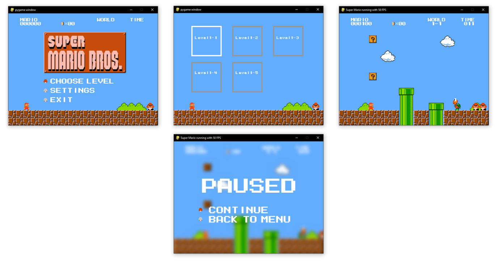

# Super Mario Implementation in Python

This project is inspired by Meth-Meth-Method's [super mario game](https://github.com/meth-meth-method/super-mario/).

## Running

To run the game, follow these steps:

1. Install the required dependencies by running the command:

   ```bash
   pip install -r requirements.txt
   ```

2. Start the game by executing the `main.py` script:

   ```bash
   python main.py
   ```

## Standalone Windows Build

If you'd like to create a standalone Windows build of the game, use the following steps:

1. Install `py2exe`:

   ```bash
   pip install py2exe
   ```

2. Run the `compile.py` script with the `py2exe` argument:

   ```bash
   python compile.py py2exe
   ```

## Controls

- **Left:** Move left
- **Right:** Move right
- **Space:** Jump
- **Shift:** Boost
- **Left/Right Mouseclick:** Secret

## Current State



## Dependencies

- [pygame](https://www.pygame.org/)
- [scipy](https://www.scipy.org/)

## Contribution

If you have any improvements, ideas, or refactors, please feel free to contact me or submit a pull request. The code is in need of refactoring, so any contribution is appreciated.

---